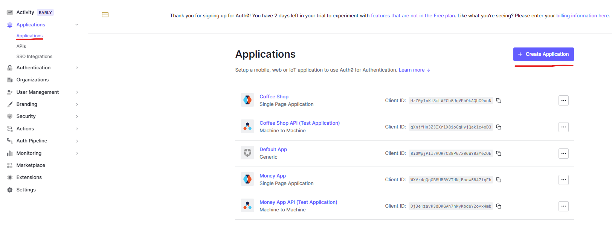
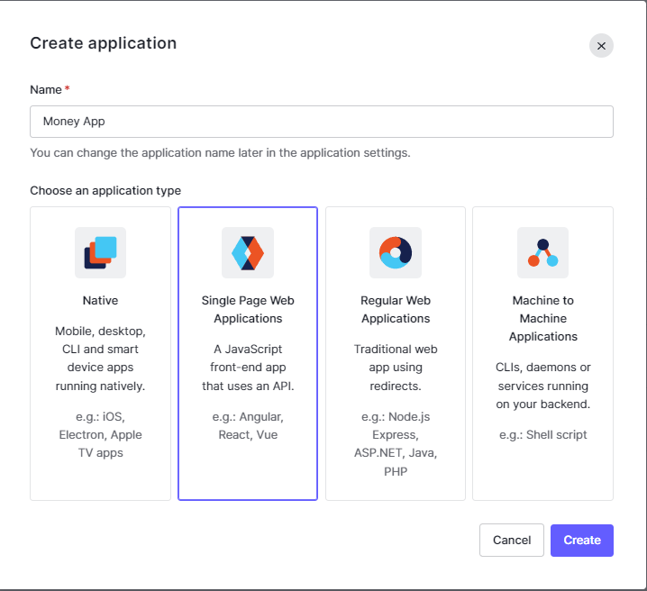
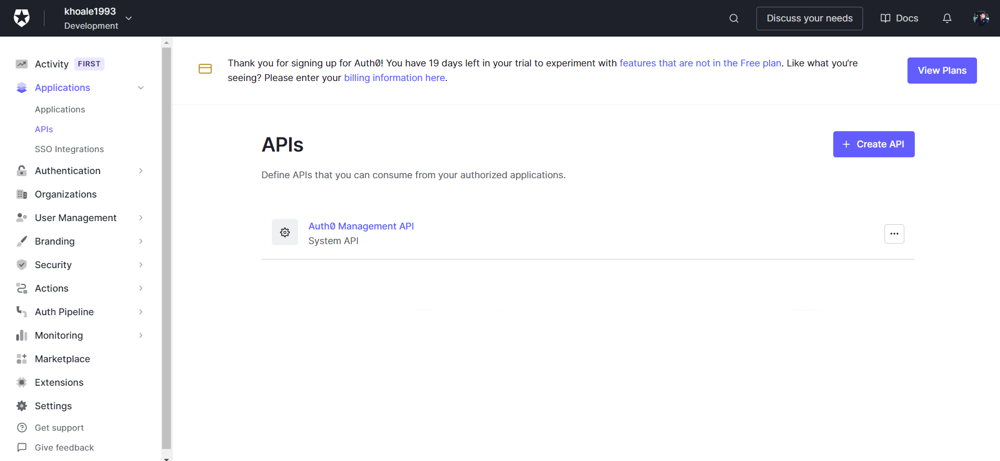
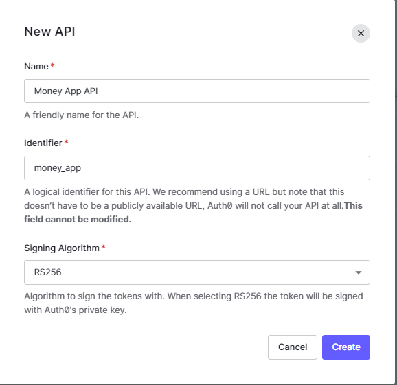
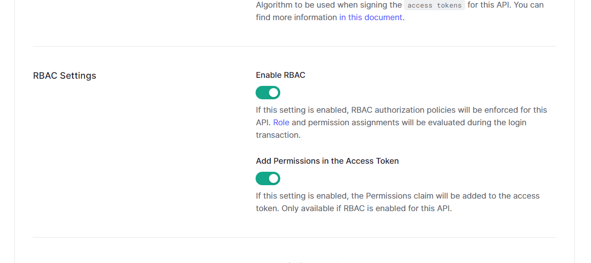
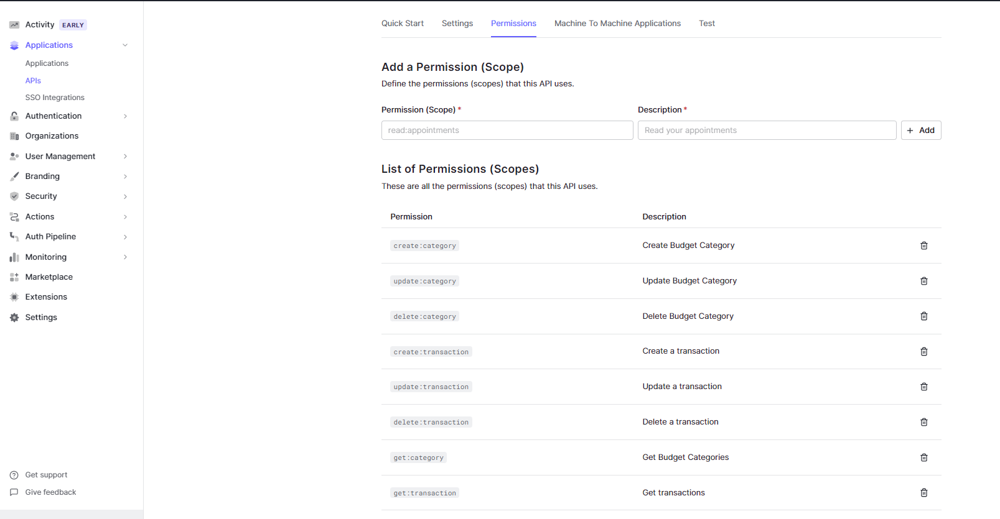
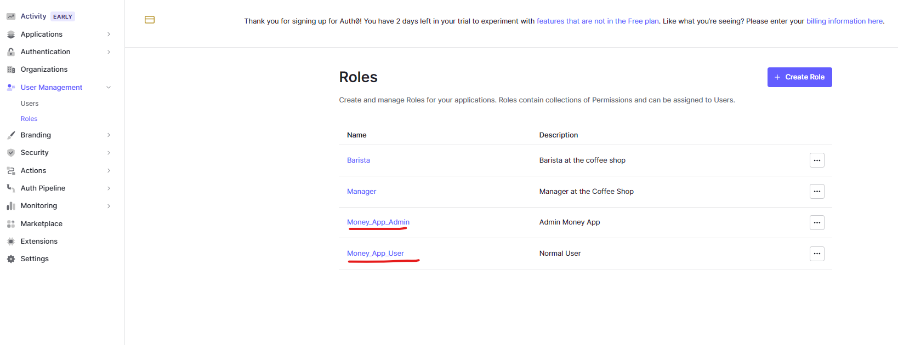
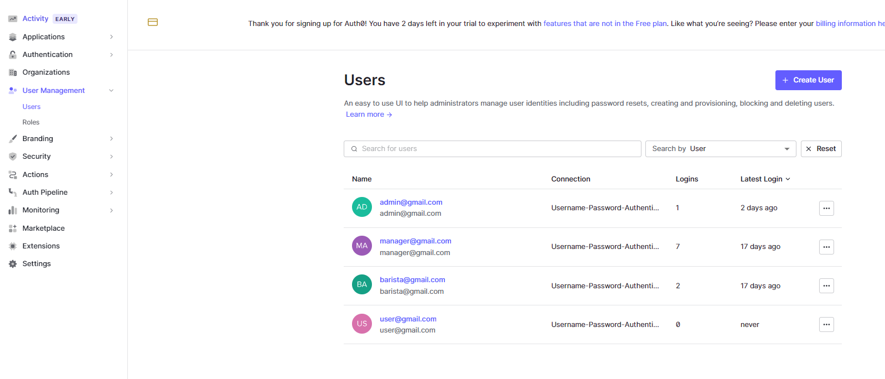
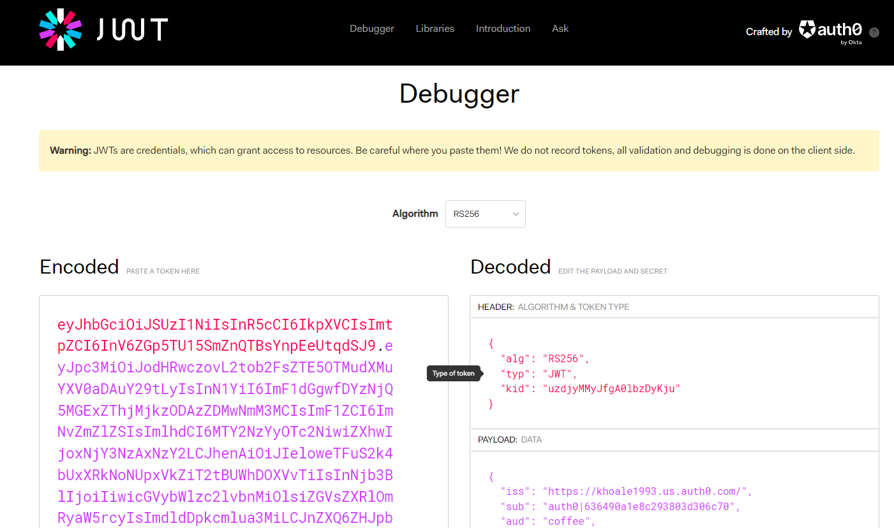

# Money App Authentication

## Set up Instructions

To start with, you must have an Auth0 account. Sign up [here](https://auth0.com/signup) for an account.

If you've already owned an account, please follow the below instructions for setting up Auth0 on this project

### Step 1: Create Application
From "Application" section in dashboard, Click **Create Application** button


Then, choose "Single Page Web Applications". Pick any name you want for the application.


### Step 2: Application configurations
Click on **Settings** tab of application that we have just created. Find section **Application URIs** and set up as below:

- Application Login URI: *We can leave blank for this box*
- Allowed Callback URLs: http://localhost:5000/token
- Allowed Logout URLs: http://localhost:5000/categories/search, http://localhost:5000/categories, http://localhost:5000/transactions/search, http://localhost:5000/transactions
- Allowed Web Origins: http://localhost:8100, http://localhost:5000
- Allowed Origins (CORS): http://localhost:8100, http://localhost:5000

### Step 3: Create API
From "APIs" section under "Applications" tab, Click "Create API" button


Fill in API information. For this project's API, we use `money_app` as identifier.




### Step 4: API configurations
In **API Settings**, turn on all options of "RBAC Settings"



### Step 5: API Permissions
Add following permissions for API:
- `get:category`
- `create:category`
- `update:category`
- `delete:category`
- `get:transaction`
- `create:transaction`
- `update:transaction`
- `delete:transaction`




### Step 6: Roles
In **Roles** from **User Management**, create 2 roles for this project:
- Admin
    - can do everything
- User
    - can only call apis with granted permissions `get:transaction` and `get:category`



### Step 7: Users
For testing purposes, we create 2 dummy users for this application.

For each user, assign approriate role for that account.



## How to generate token for testing
From browser, navigate to below url:

URL: https://khoale1993.us.auth0.com/authorize?audience=money_app&response_type=token&client_id=WXVr4gQqOBMUBBVVTdNjBsaw5847iqFb&redirect_uri=http://localhost:5000/token

In login screen, login as one of these roles for testing:

Account:
```
email: admin@gmail.com
password: Admin@123
```

Manager
```
email: user@gmail.com
password: User@123
```

Generated token will expire in: `72000 seconds`

## Verify token permissions

A quick way to verify token permissions is copy access token from browser and paste them to https://jwt.io/

